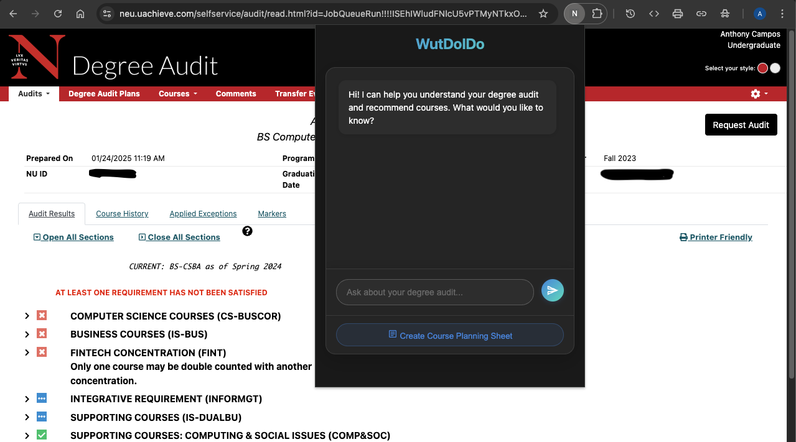

# NEU Degree Audit Helper (WutDoIDo)

  

## Project Overview
WutDoIDo is a Chrome extension designed to enhance the Northeastern University degree audit experience. The goal is to help students better understand their academic progress and plan their future courses more effectively.

## Core Features (Planned)
1. **Course Schedule Planning**
   - Automatically creates a Google Sheets document with a structured course schedule
   - Organizes completed and in-progress courses by semester
   - Provides a clear visual layout for future course planning
   - Includes sections for CO-OP periods and notes

2. **Degree Progress Analysis**
   - Parses the degree audit to extract:
     - Student information
     - Completed courses
     - Major requirements
     - Course prerequisites
     - GPA requirements

3. **Course Recommendations**
   - Suggests courses based on:
     - Completed prerequisites
     - Major requirements
     - Course availability
     - Typical course sequences

## Current Status

### Completed Features
- Basic Chrome extension setup
- Google Sheets integration
- Initial degree audit parsing framework
- Sheet template creation with:
  - Course Schedule layout
  - Student Info section
  - Requirements section
  - Course History section

### In Progress
1. **Audit Data Parsing**
   - Currently working on improving the parsing of:
     - Course information
     - Section requirements
     - Prerequisites
   - Need to handle various HTML structures in the degree audit page

2. **Course Schedule Population**
   - Basic sheet structure is created
   - Working on correctly populating courses by semester
   - Need to implement proper term/year organization

3. **User Interface**
   - Basic popup interface implemented
   - Need to add:
     - Course recommendation interface
     - Interactive planning features
     - Progress visualization

### Next Steps
1. Complete the degree audit parsing system
2. Implement proper course organization in the Google Sheet
3. Add course recommendation logic
4. Enhance the user interface
5. Add data validation and error handling
6. Implement course prerequisite checking

## Project Goals
The ultimate goal is to create a comprehensive tool that helps NEU students:
- Better understand their degree progress
- Plan future semesters more effectively
- Make informed decisions about course selection
- Track prerequisites and requirements
- Visualize their academic journey

This tool aims to simplify the course planning process and provide clear insights into degree requirements and progress.
